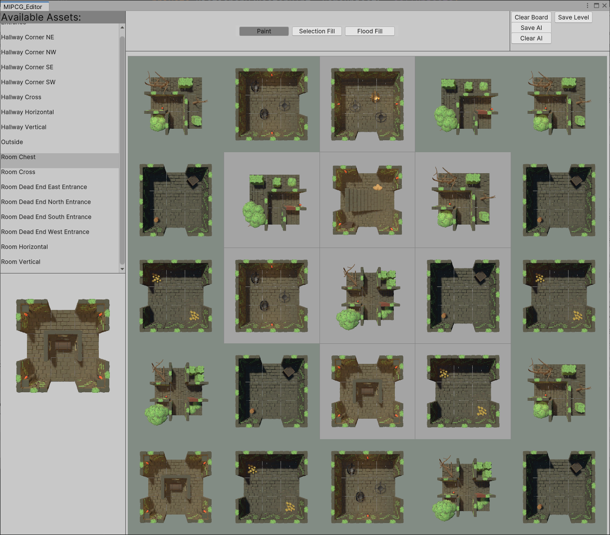
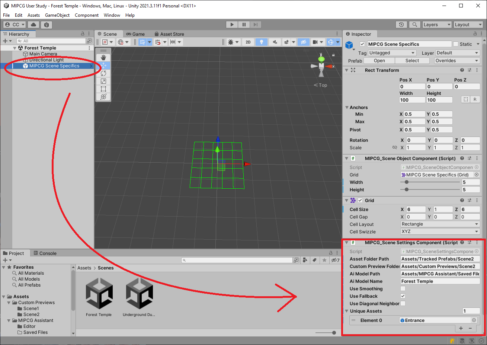
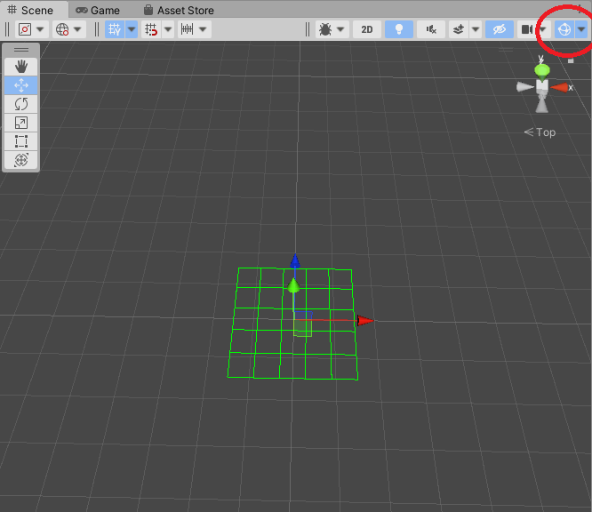

## **Instructions**:

For my master’s thesis, I created a mixed-initiative level generation tool for the Unity game engine. It is designed to assist level designers, by learning from their designs and offering them auto-completions of empty level space. 

I would like you to test this tool in the following user study. You will receive the tool and two Unity scenes, the “**Underground Dungeon**“ and “**Forest Temple**”. These scenes are already set up for you. Each scene has its own asset pool made up of Unity prefabs. The underlying game concept is the same for both scenes. The player will need to collect treasure chests, kill monsters and avoid traps, in a dungeon crawler setting. You can find the prepared scenes in the “**Assets/Scenes**” folder.

Your task is to create at least two levels for each scene, but feel free to create as many as you want. Afterward, please fill out the [survey](https://mipcg.limesurvey.net).

The only things you need to do before you can start are to install the **Unity 2021 LTS** version, download and extract this project from GitHub, open one of the scenes and open the custom level editor in the toolbar under ***Window -> MIPCG Editor***.

The recommended workflow is the following:
* Fill in the parts of the level you want to create manually.
* Let the AI fill in the rest. 
* Repeat until you are satisfied with the result.
* Press the “Save AI” and “Save Level” buttons.
* Clear the board with the “Clear Board” button and start your next level. You don’t need to create a new Unity scene to start with a new level.

If you are finished with your first scene open the other one and repeat the workflow. 

Below you will find a short description of the tool and how to use it.

## **Description**:
MIPCG Assistant is a custom Editor for the Unity game engine. It is made to help you create levels on 2D grids via AI assistance. The AI agent will learn from the grid cell neighborhoods you create inside the level. You can open the custom editor from the “**Window**” tab in the top toolbar with the “**MIPCG Editor**” button. 

In the left panel, you can see the list of available assets for the current scene. Below this list, you will see a preview image of the selected asset for better asset recognition. The bottom right panel displays the current level grid. Here, you will see the assets you add to the level and also the part that gets auto-completed by the AI assistant. To make it more obvious which elements are added by the AI the icons will be displayed with a different background color. You can always hide the elements added by the AI by pressing the Space bar when the custom editor window is focused. Pressing the space bar again will make them appear again.

In the top bar, you can choose from three different editing tools. You use the selected one by clicking on the grid. 

* “**Paint**” lets add the selected asset to the scene as you would paint with a brush. 
* “**Selection Fill**” lets you select a box where the currently selected asset will be placed.  
* “**Flood Fill**” fills in all connected grid cells that contain the same asset or are empty, starting with the one you clicked. 

All of these tools can also be used to erase assets from the scene with the right mosue button.

The buttons in the top right of the editor are used to save or clear the level or the AI memory.

* “**Clear Board**” will reset the current level. On clearing the level, the AI will also forget every piece of information that it stored about the current level.
* “**Save AI**” will save the current AI information to a json file. Press this button, if you wish to save the current AI memory for your next level.
* “**Clear AI**” will erase the AI memory without changing the current level.  
* “**Save Level**” will save the current level, including the AI auto completed parts, to a text file. These text files can be uploaded to the survey. 

The Editor is connected to two Components inside the scene hierarchy. The “MIPCG_Scene Object Component” handles level size and all the game objects. The “MIPCG_Scene Settings Component” handles the Asset and AI Algorithm setting. You can locate them by selecting the “MIPCG Scene Specifics” GameObject in the scene hierarchy. After you selected the object, you can change the component settings inside the “Inspector“ panel which is usually located on the right side of the screen.

The most important settings for the designer are the three checkbox toggles found on the Settings Component: 

* “**Use Smoothing**” – If checked, the AI will try to offer more variety, meaning that rare assets will appear more often. Note that this will create more random-looking auto-completion.
* “**Use Fallback**” – If checked, the AI will offer you auto-completions, even if there are no fitting assets for a given neighborhood. Note that disabling fallback will result in some cases where the AI will fail to fill in the level. If unchecked, auto-completion will only use neighborhoods that you taught the AI.
* “**Use Diagonal Neighborhoods**” – if checked, the AI will use diagonal neighborhoods as well as straight ones. In scenarios where there are mostly horizontal or vertical assets this can improve AI results. 

You can hide the green grid inside the scene view with the "Gizmos" toggle.

